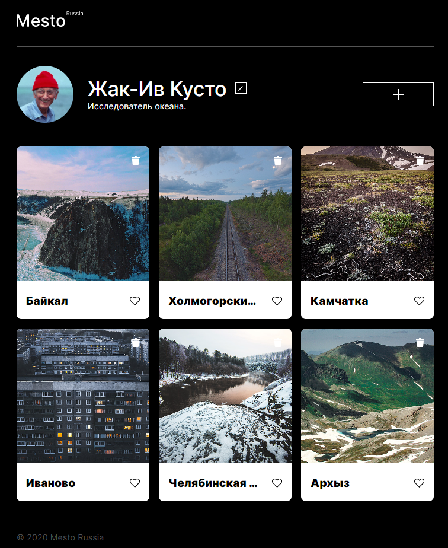

# Mesto
>Hello, everyone! This is my first pet project. I hope you find it interesting for yourself. :heart::heart::heart:  

Project **Mesto** is a litle project implemented in vanilla js.

This project was implemented as part of the course "Web Developer" from [Practicum.Yandex :yellow_heart:](https://practicum.yandex.ru/)

## Technology Stack:
* **HTML**
  * Template tags
  * Forms
* **CSS**
  * Media queries
  * Responsive design
* **JavaScript**
  * Arrays
  * Cycles
  * Functions

## The project should look like this:


## I'm in social video:
* :camera: **[Instagram]()**
* :airplane: **[Telegram]()**


<!-- 


# Header 1
## Header 2
### Header 3
___

**bold**
*italic*
***bold italic***

__text__
_text_
___text___
## ~~texttext~~

:yellow_heart:

> quote
> >quoute

Текстовая строка, внутри которой расположен `код`

```javascript
const popupElement = document.querySelector('')
```

* какой-то текст
  * ааа
    * аааа
      - аааа
        - аааа

- какой-то текст
  
1. ааа
2. ааааа
   1. аааа
   2. 1

* [x] fffff
* [ ] ffff
  * [ ] ffff

https://github.com/adam-p/markdown-here/wiki/Markdown-Cheatsheet

[markdown emoji](https://github.com/adam-p/markdown-here/wiki/Markdown-Cheatsheet)


![respects] -->